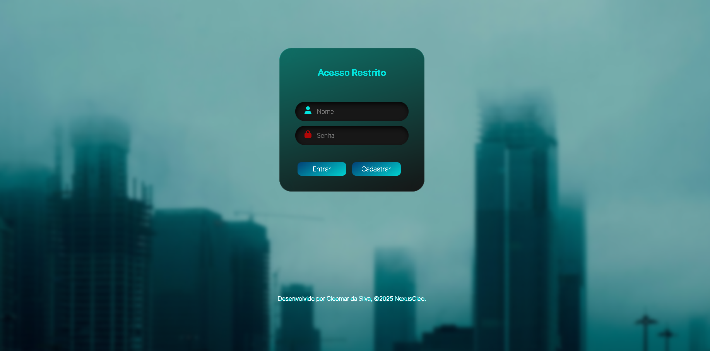
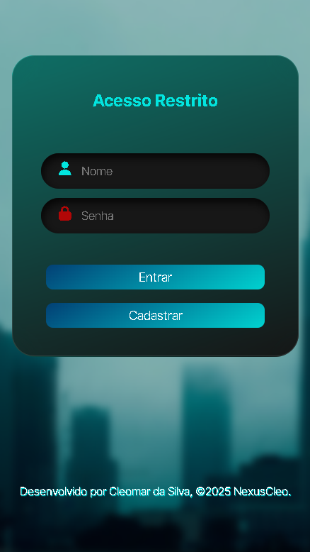

# Página de Login Responsiva


Projeto de uma página de login com design moderno, futurista e totalmente responsivo, construído com HTML5 e CSS3. A interface utiliza o conceito de *glassmorphism* para criar um efeito de vidro translúcido, combinado com gradientes e um tema escuro.

## 🎨 Visualização do Projeto

Abaixo estão os espaços para você adicionar capturas de tela do projeto. Para substituir, basta alterar o caminho nos links abaixo.

### Versão Desktop



### Versão Mobile



---

## ✨ Funcionalidades

- **Design Responsivo**: O layout se adapta perfeitamente a telas de desktops, tablets e celulares (com um ponto de quebra principal em 768px).
- **Estética Moderna**: Utiliza o efeito de *glassmorphism* (vidro fosco) no card de login, com bordas em gradiente e um fundo desfocado.
- **Interatividade**: Efeitos de `hover` sutis no card e nos botões, melhorando a experiência do usuário.
- **Ícones Integrados**: Campos de formulário (`Nome` e `Senha`) com ícones do Font Awesome para melhor usabilidade.
- **Fontes Customizadas**: Usa a fonte "Inter Tight" do Google Fonts para uma tipografia elegante.
- **Estrutura Limpa**: Código HTML semântico e CSS bem organizado e comentado.

---

## 🛠️ Tecnologias Utilizadas

O projeto foi desenvolvido utilizando as seguintes tecnologias:

- **HTML5**: Para a estrutura e semântica da página.
- **CSS3**: Para estilização, layout com Flexbox, gradientes, responsividade e animações.
- **Font Awesome**: Para os ícones vetoriais nos campos de entrada.
- **Google Fonts**: Para a fonte personalizada do projeto.

---

## 🚀 Como Executar

Este projeto é composto apenas por arquivos front-end e não requer um servidor ou instalação complexa.

1.  Clone o repositório para sua máquina local:
    ```bash
    git clone https://github.com/seu-usuario/seu-repositorio.git
    ```
2.  Navegue até o diretório do projeto:
    ```bash
    cd seu-repositorio
    ```
3.  Abra o arquivo `index.html` no seu navegador de preferência.

E pronto! A página de login será exibida.

Ou clique no link de deploy:

---

## ✒️ Autor

Este projeto foi desenvolvido por **Cleomar da Silva**.

---

## 📄 Licença

Este projeto está sob a licença MIT. Veja o arquivo LICENSE para mais detalhes.

> Criado com base no código e estrutura fornecidos. &copy; 2025 NexusCleo.